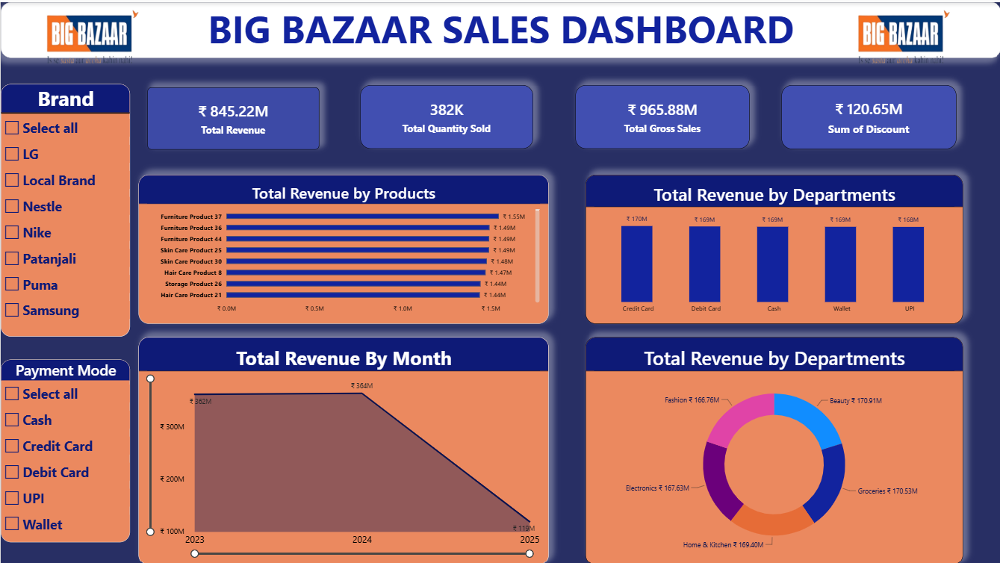

# 🛒 BIG BAZAAR SALES DASHBOARD

## 📖 Overview
The Big Bazaar Sales Dashboard is an interactive Excel-based Business Intelligence project developed to analyze sales performance, revenue trends, product performance, customer payment preferences, and departmental contributions. The dashboard converts large-scale retail sales data into meaningful insights through dynamic visualizations and KPI metrics.

## 📸 Dashboard Preview


## 🎯 Key Performance Indicators (KPIs)

| Metric | Value |
|----------|----------|
| Total Revenue | ₹ 845.22M |
| Total Quantity Sold | 382K |
| Total Gross Sales | ₹ 965.88M |
| Total Discount | ₹ 120.65M |

## 📊 Dashboard Features

### Revenue Analysis
- Total Revenue by Products
- Total Revenue by Departments
- Monthly Revenue Trend Analysis

### Interactive Filters
- Brand Filter
  - LG
  - Local Brand
  - Nestle
  - Nike
  - Patanjali
  - Puma
  - Samsung

- Payment Mode Filter
  - Cash
  - Credit Card
  - Debit Card
  - UPI
  - Wallet

### Visualizations
- KPI Cards
- Horizontal Bar Charts
- Column Charts
- Doughnut Chart
- Trend Analysis Chart
- Interactive Slicers

## 🔧 Tools & Technologies Used

- Microsoft Excel
- Pivot Tables
- Pivot Charts
- Slicers
- Data Cleaning
- Data Analysis
- Conditional Formatting
- Dashboard Design
- Business Intelligence Reporting

## 📈 Key Insights

- Revenue exceeded ₹845 Million across all product categories.
- Beauty and Grocery departments generated the highest revenue.
- Credit Card transactions contributed significantly to overall sales.
- Monthly revenue remained stable before experiencing a decline in the final year.
- Product-level analysis helps identify top-performing items and sales opportunities.

## 🚀 Project Highlights

This project demonstrates expertise in:

- Data Analytics
- Business Intelligence
- Dashboard Development
- Sales Performance Analysis
- Data Visualization
- Retail Analytics
- Advanced Microsoft Excel

## 📂 Project Structure

```text
├── Dataset.xlsx
├── Dashboard.xlsx
├── BIG_BAZAAR_Dashboard.png
└── README.md
```

## 👨‍💻 Author

**Kanish Singh**

### Connect With Me
- GitHub: https://github.com/yourusername
- LinkedIn: https://linkedin.com/in/yourprofile

---

⭐ If you found this project useful, don't forget to Star this repository!
